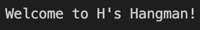
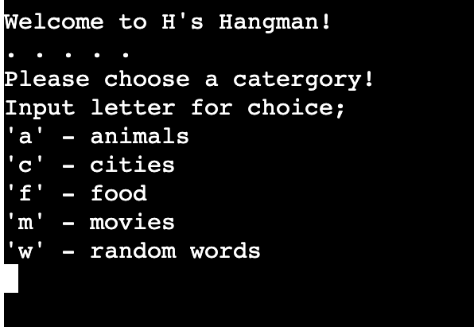
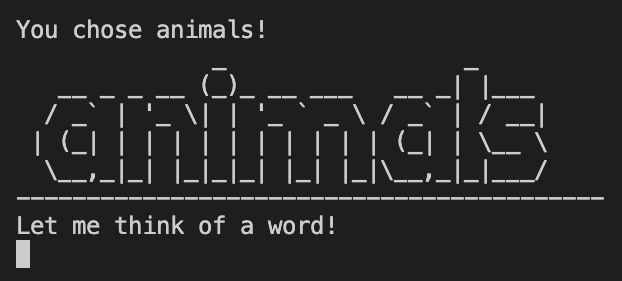
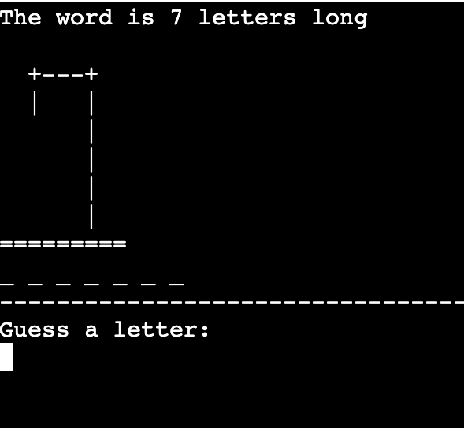
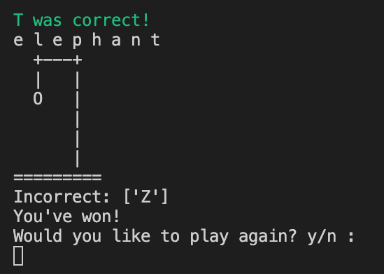
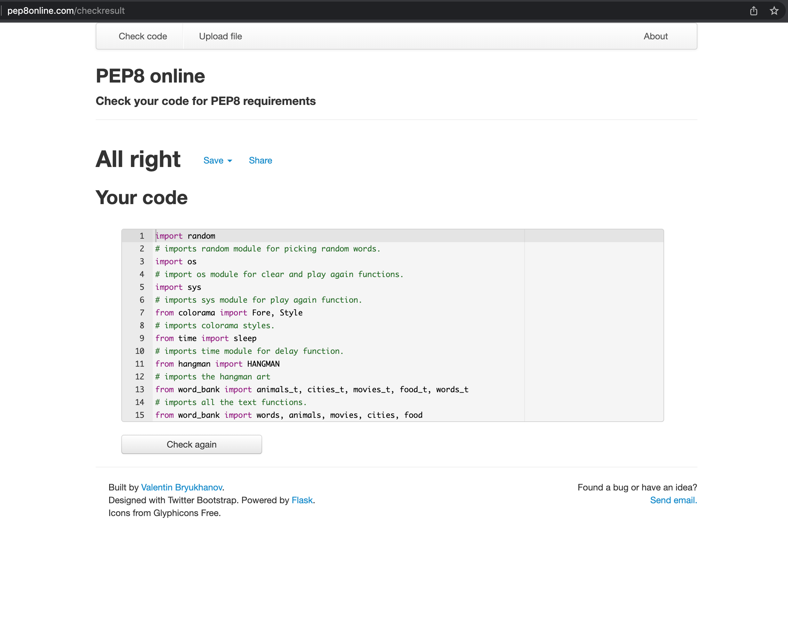
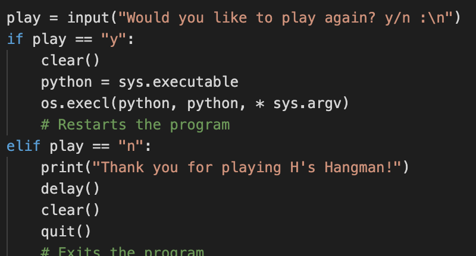
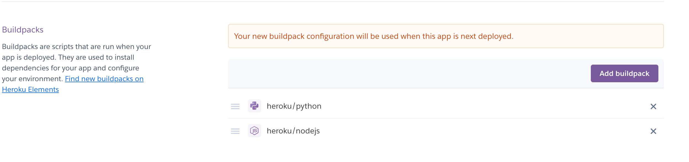

# H's Hangman

H's Hangman is a Python terminal game, which runs in the Code Institue mock terminal on Heroku.

Users pick a catergory and a word from that catergory will be randomly generated. The user has to try to guess the word before the diagram of hangman is completed with allocated guesses.

## How to play 
- H's Hangman is based on the classic paper and pencil guessing game. You can read more about it on [Wikipedia](https://en.wikipedia.org/wiki/Hangman_(game))
- In this version of hangman game, the player enters the game with a choice of catergories. The player has to choose a listed catergory in order to begin the game.
- Once a catergory has been chosen the computer will think of a random word in relation to the chosen catergory. For exmaple if the user chooses capital cities the word would be a city somewher in the world.
- The player gets to know how many letters the word contains by the amount of underscores and the default diagram of hangman is printed.
- The player inputs a-z characters in a bid to guess the word. Everytime a correct character is entered the computer will tell them its correct and place the letter on the correct underscore, the hangman diagram will not change.
- Everytime the player guesses incorrect the computer will tell them its incorrect, add the letter to the incorrect list and the diagram of hangman will gain an element/body part.
- The player has 6 guesses all together to guess all the letters in the word before the completed diagram would mean the games been lost.
- A simple yes(y) or no(n) at the end will let the player play again at end the game.

## Features
### Welcome message/Landing page
- When the player begins the program a welcome message saying "Welcome to H's Hangman!" is displayed.
- There is a time delay before the user is given the category choices for cleaner gameplay, so they aren't rushed straight into category choices.

### Catergory choice 
- The player is given a choice of 5 categories to choose their words based from; 'a' for animal words, 'c' for world cities, 'f' for foods, 'm' for movies and 'w' for random difficult words.
- In order to continue the player must input one of these letters.
- The game will play after and choose a word based on the catergory, kind of giving the player a hint.
- This makes gameplay more interactive for the player as they are given the choice on the what the word is based on.

### After catergory selection
- Once the player has chosen a catergory, an ASCII art of the catergory word will be shown.
- The computer will then display a delayed message saying "Let me think of a word!".
- The player will then be put into the hangman game.
- This is for visual effect allowing for more dynamic gameplay. 

### Hangman game
#### The hangman game is very simple to understand;
- On the top the hidden word is displayed with underscores along with a message hinting how many letters the word contains.
- In the middle is a hangman graphic that to begin with is shown as default.
- On the bottom is an empty list yet to contain incorrect guesses.

- If the player guesses correct, the underscore will be replaced with the letter based on where the letter goes in the word. Also a display message in colour green will be shown to say the letter guessed was correct. The hangman graphic and incorrect list will not append.
- If the player guesses incorrect, a display message in colour red will be shown to say the letter was incorrect. The incorrect letter will be added to the incorrect list and an element of body part will be appended to the hangman graphic. 
- If the player enter an invalid character they will be prompted with an error message and input box will be returned.

- Once the player has entered all the correct letters they will have won the game.
- If the player uses all 6 attempts they will lose the game, the hangman graphic will be complete and the computer will show what the word is.

- The colours add visual effect for correct and incorrect as well as the hangman graphic. All the letter are capitalised as weill for cleaner viewing. When the guess is entered the computer will check the guess with a short delay. This make it look like the comouter is thinking and checking instead of it just being instant.

### Play again function
- After the player has either won or lost they are given the choice if they want to restart or quit the game.
- The restart will direct them back to the beginning and they will be given the catergory choice again.
- The quit will quit the program.

## Testing

### Code Validation
- All code valiadation for python files has been checked on http://pep8online.com/.

- All code on run.py showed no errors or changes needed to be made.

[hangman.py](documentation/testing/code-validation/hangman.png)

- All code on hangman.py showed no errors or changes needed to be made.

[word_bank.py](documentation/testing/code-validation/word_bank.png)

- All code on word_bank.py showed no errors or changes needed to be made.
- ASCII art in word_bank.py shows up 'invalid escape sequence' warnings on gitpod but clear the valiadator just fine.

### Browser Compatibility and Responsiveness

- Repository is being displayed through heroku website so code was checked on safari, chrome and firefox. 
- Because the repository is being displayed through heroku app the website automatically adjusts the screen size and no media queries have been used.

### Fixed Bugs
- Bug fixed where the game would restart but still keep the word in place and the hangman art level from the previous round. This was fixed by using the restart method;

### Unfixed Bugs

- Unfixed bug of where when an invalid answer is entered it prompts the error message which it is supposed to but then when the user enters a valid option after the invalid option will display in the overhead text, but will not the invalid option to incorrect or correct lists. Tried several but have been unable to troubleshoot this issue. Gameplay continues perfectly after just the guess after the invalid guess the bug appears.

## Deployment

The site was deployed to Heroku. The steps to deploy are as follows: 
  - From the Heroku dashboard, click the “Create new app” button.
  - Once the app has been created, click on "Settings" tab.
  - The next step is to add a couple of buildpacks to the application. Python first and then Node.js in the order as shown below;

  
  - From there head to the "Deploy" tab, select the deployment method to GitHub and connect your GitHub account.
  - Using the search button, such for the repository name (h_hangman in my case) and click "Connect" to link up.
  - Scroll down and click "Deploy Branch" in the manual section. The page will be deployed and ready to view in a few seconds.

### Local Deployment

In order to make a local copy of this project, you can clone it. In your IDE Terminal, type the following command to clone my repository:

- `git clone https://github.com/henrysevern/h_hangman.git`

Alternatively, if using Gitpod, you can click below to create your own workspace using this repository.

  ## Credits 

  - Hangman ASCII art was taken from https://gist.github.com/chrishorton/8510732aa9a80a03c829b09f12e20d9c
  - ASCII art was taken from https://www.asciiart.eu/
  - Clear function, restart function, delay function with assistance from https://stackoverflow.com/
  - Random words list taken from https://futureofworking.com/40-hardest-words-to-guess-in-hangman/
  - Animals words list taken from https://gist.github.com/atduskgreg/3cf8ef48cb0d29cf151bedad81553a54

