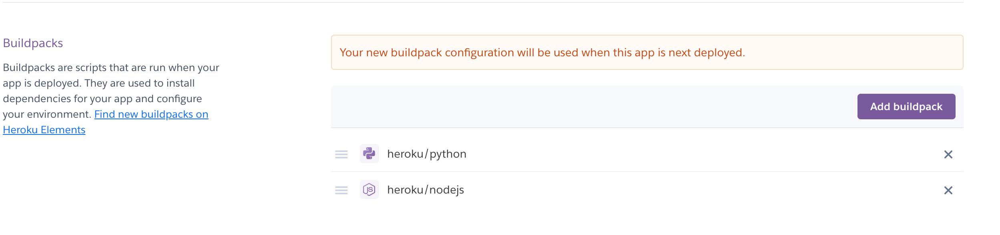

Welcome henrysevern,

This is the Code Institute student template for deploying your third portfolio project, the Python command-line project. The last update to this file was: **August 17, 2021**

## Reminders

* Your code must be placed in the `run.py` file
* Your dependencies must be placed in the `requirements.txt` file
* Do not edit any of the other files or your code may not deploy properly

## Creating the Heroku app

When you create the app, you will need to add two buildpacks from the _Settings_ tab. The ordering is as follows:

1. `heroku/python`
2. `heroku/nodejs`

You must then create a _Config Var_ called `PORT`. Set this to `8000`

If you have credentials, such as in the Love Sandwiches project, you must create another _Config Var_ called `CREDS` and paste the JSON into the value field.

Connect your GitHub repository and deploy as normal.

## Deployment

The site was deployed to Heroku. The steps to deploy are as follows: 
  - From the Heroku dashboard, click the “Create new app” button.
  - Once the app has been created, click on "Settings" tab.
  - The next step is to add a couple of buildpacks to the application. Python first and then Node.js in the order as shown below;
  
  - From there head to the "Deploy" tab, select the deployment method to GitHub and connect your GitHub account.
  - Using the search button, such for the repository name (h_hangman in my case) and click "Connect" to link up.
  - Scroll down and click "Deploy Branch" in the manual section. The page will be deployed and ready to view in a few seconds.